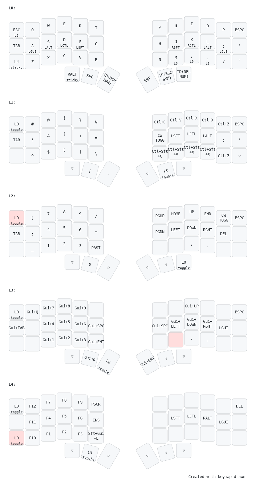

# Personal qmk config for my corne

## Features

- Tap dance on thumb 3,5 and 6:

  - First tap sends normal keycode (minus,escape and delete respectively)
  - Hold activates the layer momentarily.
  - Double tap toggles that same layer.

- Tap hold on dot for exclamation and comma for pipe, and for layer switching on
  escape and m keys.

- Dedicated layer for window navigation in hyprland.

- Double tap hold and j k l repeats the key for vim navigation.

- Home row mods with chordal hold for enforcing opposing hands rules, like
  miryoku.

## Layout

